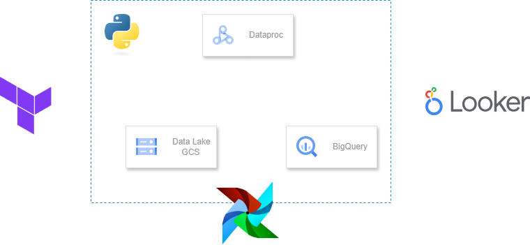
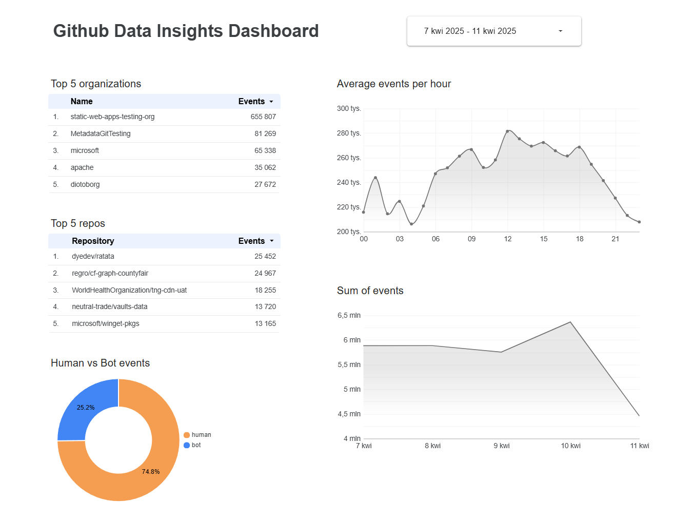
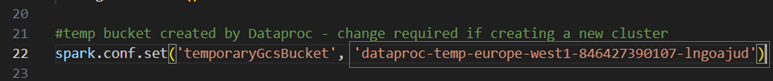
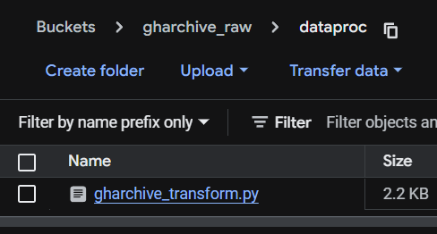
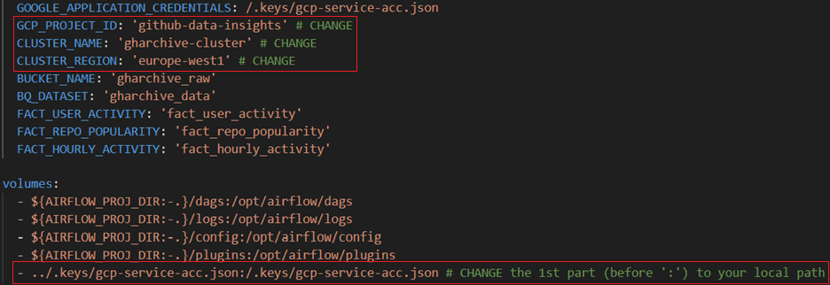
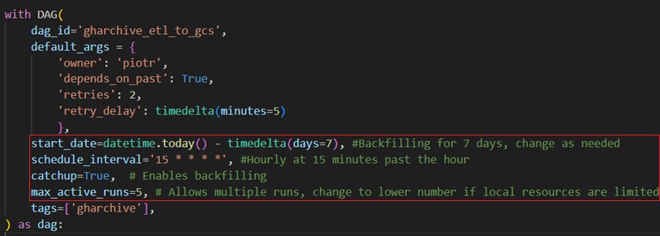

# Github Data Insights 
<i> This is the final project for the [DataTalksClub/data-engineering-zoomcamp](https://github.com/DataTalksClub/data-engineering-zoomcamp). Cheers to the team for creating such a great place to learn Data Engineering!</i>

### Project Purpose
This project explores interesting insights from the [GitHub Archive](https://www.gharchive.org/) dataset. The goal is to answer some commonly asked questions about GitHub activity, such as:
* What are the most popular repositories and organizations?
* How many events are performed by humans vs. bots?
* Which hour of the day sees the most activity?
* How many events are performed each day?

The project aims to address all of these questions by building a robust data pipeline.

### Solution Overview
To solve these problems, I’ve created a data pipeline that runs on a scheduled basis. Here's a high-level overview of the approach:
1. Infrastructure Setup: 
    * We use [Terraform](https://www.terraform.io/) to provision the necessary infrastructure on [Google Cloud Platform](https://cloud.google.com/).
2. Data Orchestration:
    * The DAG runs on [Apache Airflow](https://airflow.apache.org/) (run locally via [Docker](https://www.docker.com/)) For the first run, it’s recommended to backfill a few days of data to have something to analyze.
3. Data Ingestion & Transformation:
    * The DAG runs hourly at 15 minutes past the hour. It performs the following:
        * Downloads the current hour’s json.gz file from GH Archive.
        * Extracts only the necessary fields and converts the file to Parquet format.
        * Uploads the Parquet file to [Google Cloud Storage](https://cloud.google.com/storage) (if it doesn’t already exist).
        * Cleans up local temporary files.
4. Data Processing & Loading:
    * The pipeline then triggers a `PySpark` script via [Dataproc](https://cloud.google.com/dataproc) to populate three fact tables in [BigQuery](https://cloud.google.com/bigquery), optimized using:
       * partitioning - on type `DAY` by field `date`, makes queries faster and cheaper because BigQuery can scan only the needed date ranges instead of the whole table.
       * clustering - by fields `user_type`, `hour`, `organization`, `repository`, it speeds up filtering and grouping queries by those fields — like if you're looking at only bots vs humans, or a specific repo's activity.
5. Visualization:
    * The data is visualized in [Looker Studio](https://lookerstudio.google.com), which automatically refreshes with new data.
    * Take a look at my [dashboard](https://lookerstudio.google.com/reporting/e55847a7-9a5d-4fee-97d7-e81942d6596f) created for this project.

### Architecture Overview


### Sample Dashboard


## Project Reproduction

### Prerequisities
> [!IMPORTANT]  
> This project was originally developed on Windows, but it should work on other operating systems as well (although not tested).
Please ensure Docker and Terraform are installed and working on your machine.

1. Clone this repository.
2. Create a new GCP project.
    * Save the `Project ID`.
> [!NOTE]
> While setting up GCP, be sure to enable the required APIs when prompted.
3. Create a Service Account (SA) with the following roles:
    * BigQuery Admin
    * Dataproc Administrator
    * Storage Admin
4. Create a JSON key for the SA and store it in the `.keys` folder.
5. Go to [Dataproc clusters](https://console.cloud.google.com/dataproc/clusters) and create a new one on `Compute Engine`:
    * Type: Standard (1 master, N workers)
    * Image: Ubuntu 22
    * Machine: `n4` (2vCPU, 1 core, 8GB memory) should be sufficient

### Reproduction Steps
1. Navigate to the `terraform` folder.
    * Configure `variables.tf` with your project-specific values.
> [!NOTE]
> Instructions are included in the file.
2. Initialize and apply the Terraform configuration in the terminal:
    ```
    terraform init
    terraform plan
    terraform apply
    ```
3. Modify the `dataproc\gharchive_transform.py` file.

4. Copy the `dataproc\gharchive_transform.py` file to your Storage Bucket under `dataproc` folder.

4. Navigate to the `airflow` folder.
    * Configure `docker-compose.yaml`.
    
    * Configure the DAG file `dags\gharchive_etl_to_gcs.py` if necessary.
    
5. Start Airflow:
    ```
    docker compose up -d
    ```
6. Open `http://localhost:8080/` in browser.
    * Login with `airflow/airflow`.
7. Trigger the DAG and relax with a cup of coffee ☕ — the backfill process will take some time.
8. Connect your BigQuery tables to Looker Studio to create a dashboard!
